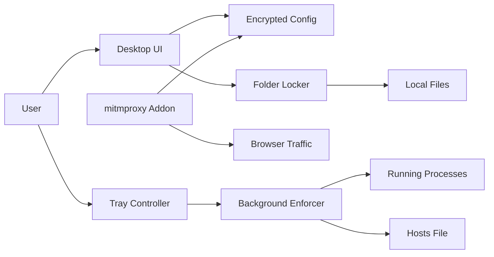
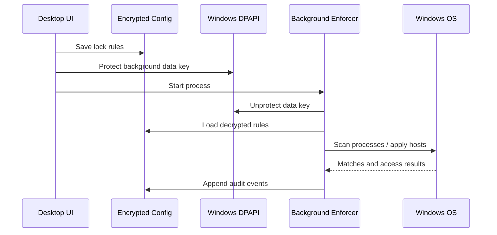

# Windslock Architecture

Windslock is organized as a local-first desktop security utility. The current
implementation is Python-based so it can move quickly while keeping core logic
testable.

## System Context



## Module Map

| Module | Responsibility |
| --- | --- |
| `gui.py` | Desktop UI and user actions |
| `tray_app.py` | Tray controller and quick actions |
| `config.py` | Encrypted config, password verification, recovery codes |
| `secure_store.py` | Windows DPAPI wrapper |
| `enforcer.py` | Background process enforcement loop |
| `app_blocker.py` | Process matching and killing |
| `site_blocker.py` | Whole-domain hosts-file block management |
| `url_rule_engine.py` | URL path rule matching |
| `proxy_addon.py` | mitmproxy HTTPS path enforcement |
| `folder_locker.py` | Folder encryption and restore |
| `override_manager.py` | Friction override state machine |
| `focus_manager.py` | Presets, sessions, schedules |
| `startup.py` | Registry startup and Task Scheduler helpers |
| `tamper.py` | Basic ACL hardening |
| `audit_log.py` | Encrypted event history |
| `brand.py` | App name, colors, and asset paths |

## Data Flow



## Core State

Encrypted config contains:

- App lock rules
- Domain rules
- URL path rules
- Locked folder records
- Focus schedules
- Override requests
- Settings
- Audit history

Security metadata contains:

- Password verifier
- Encrypted data-key envelope
- Recovery code verifiers
- Recovery code envelopes

Background mode contains:

- DPAPI-protected data key for the current Windows user

## Enforcement Boundaries

Windslock has three enforcement layers:

1. Process layer: detects blocked apps and kills matching processes.
2. DNS/hosts layer: blocks whole domains with reversible hosts-file markers.
3. Proxy layer: blocks URL paths by inspecting full URLs through mitmproxy.

Folder locking is not background enforcement. It is data transformation:

1. Archive folder.
2. Encrypt archive.
3. Verify encrypted archive.
4. Remove original folder only after verification.

## Security Boundaries

Windslock protects against:

- Casual bypass
- Accidental access
- Impulsive app/site opening
- Plain-text config editing
- Simple folder browsing

Windslock does not fully protect against:

- A local administrator
- Booting another OS
- Deleting the app
- Removing scheduled tasks
- Editing hosts as admin
- Browsers/apps bypassing the proxy

## Recommended Next Refactor

To support Windows and Linux cleanly, introduce platform adapters:

```text
windslock/
  core/
    config.py
    overrides.py
    focus.py
    rules.py
    audit.py
  platform/
    windows/
      secure_store.py
      startup.py
      hosts.py
      processes.py
    linux/
      secure_store.py
      startup.py
      hosts.py
      processes.py
  ui/
    desktop.py
    tray.py
```

The shared core should never call Windows-specific APIs directly. Platform
modules should expose the same interface on Windows and Linux.

## Test Strategy

Automated:

- Config encryption and password verification
- Recovery code reset
- Folder lock/unlock
- App rule normalization
- Hosts block generation and rollback
- URL path rule matching
- Override state transitions
- Focus sessions and schedules

Manual:

- Real process killing
- Real hosts-file writes
- mitmproxy certificate install
- Tray behavior
- Startup task behavior
- Portable EXE launch
