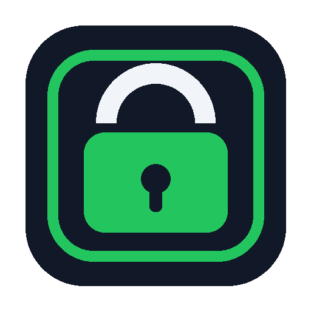

# Windslock Brand Guide

Windslock is a focus-security product: calm, trustworthy, practical, and firm.
The brand should feel like a professional Windows utility, not a game, scareware,
or a parental-control toy.

## Brand Position

**Name:** Windslock  
**Tagline:** Focus Security for Windows  
**Category:** Personal app, website, and folder locker  
**Promise:** Lock distractions and private spaces without losing control of your own machine.

## Logo

Primary logo:


Icon:



Usage rules:

- Keep clear space around the logo equal to the width of the lock shackle.
- Use the icon alone only in compact contexts: tray, taskbar, installer, shortcut.
- Do not stretch, rotate, recolor, or add shadows to the logo.
- Use the full logo in README, installer, splash, and About screens.

## Color Palette

| Token | Hex | Usage |
| --- | --- | --- |
| Lock Navy | `#111827` | Primary text, app shell, high-trust surfaces |
| Signal Green | `#22C55E` | Secure/active/confirmed states |
| Focus Blue | `#2563EB` | Primary actions and selected navigation |
| Slate | `#334155` | Secondary text and quiet labels |
| Mist | `#F8FAFC` | App background |
| Panel | `#FFFFFF` | Content panels |
| Border | `#CBD5E1` | Dividers and input borders |
| Warning | `#F59E0B` | Cooldown, pending, attention |
| Danger | `#DC2626` | Denied, blocked, destructive controls |

### Palette Rules

- The UI should be mostly neutral with green/blue accents.
- Use green for protection status and successful secure actions.
- Use blue for normal primary commands.
- Use warning amber for cooldown and pending override states.
- Use red only for denied actions, stopped enforcement, or destructive warnings.
- Avoid all-purple gradients, dark cyberpunk styling, and aggressive alarm colors.

## Typography

Preferred app font:

- Windows: Segoe UI
- Linux: Inter, Noto Sans, or system sans-serif

Type scale:

| Role | Size | Weight |
| --- | ---: | ---: |
| App title | 20-24 | 700 |
| Page title | 18-20 | 650 |
| Section title | 14-16 | 600 |
| Body | 11-13 | 400 |
| Table text | 10-12 | 400 |
| Status labels | 10-12 | 500 |

## UI Personality

Windslock should communicate:

- Control without panic
- Security without drama
- Friction without punishment
- Recovery without shame

Use plain language:

- Good: “Background enforcement is running.”
- Good: “This override starts after the cooldown.”
- Avoid: “Intrusion detected.”
- Avoid: “You are forbidden.”

## Component Guidelines

Primary buttons:

- Use for one main action in a group.
- Labels should be short: “Start session”, “Apply preset”, “Lock folder”.

Secondary buttons:

- Use for utility actions: “Refresh”, “Browse”, “Remove selected”.

Status chips:

- Running: green
- Stopped: red
- Cooldown: amber
- Active override: blue
- Expired/re-locked: slate

Tables:

- Prefer dense, scannable tables for rules, history, schedules, and overrides.
- Avoid card-heavy layouts for operational screens.

## App Screens

Core navigation:

- Dashboard
- Focus
- Apps
- Websites
- Folders
- Overrides
- History
- Settings

Dashboard should answer three questions immediately:

- Is enforcement running?
- What is currently protected?
- What needs attention?

## Voice And Messaging

Windslock is firm but respectful.

Examples:

- “Wrong phrase. Override denied and logged.”
- “Cooldown started. The target remains locked until the timer ends.”
- “Override active. Windslock will re-lock automatically.”
- “Admin users can bypass local protections. Use this as personal focus security, not enterprise device control.”

## File Assets

- `assets/windslock_logo.png`
- `assets/windslock_icon.png`
- `assets/windslock.ico`
- `generate_brand_assets.py`

Regenerate assets:

```powershell
D:\Windslock\files\.venv\Scripts\python.exe generate_brand_assets.py
```
