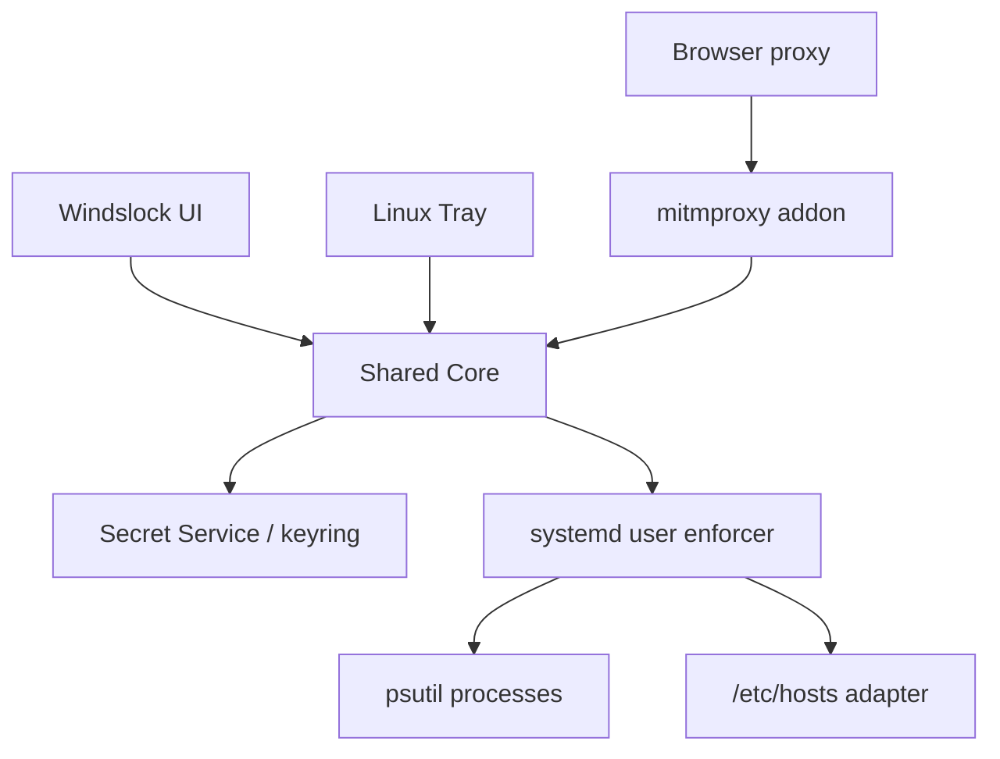

# Windows And Linux App Plan

Windslock should become a cross-platform focus-security app while keeping one
shared core. Windows and Linux need different low-level adapters, but users
should see the same product model.

## Product Goal

One Windslock experience:

- Same brand
- Same lock rules
- Same focus sessions
- Same override friction
- Same history
- Same recovery story

Different OS integrations:

- Windows: DPAPI, Task Scheduler, hosts file, tray, PyInstaller
- Linux: Secret Service/keyring, systemd user service, `/etc/hosts`, tray, AppImage/deb/rpm

## Shared Core

Keep these platform-independent:

- Config schema
- Password/recovery logic
- Rule model
- Override state machine
- Focus presets/schedules
- URL path matching
- Audit log model
- Folder encryption format
- Tests for business logic

## Platform Adapter Matrix

| Capability | Windows | Linux |
| --- | --- | --- |
| Secure local key | DPAPI current-user secret | Secret Service, KWallet, GNOME Keyring, or Python keyring |
| Startup | Task Scheduler or Run key | systemd user service or autostart `.desktop` |
| Whole-domain block | `C:\Windows\System32\drivers\etc\hosts` | `/etc/hosts` |
| Process detection | `psutil` | `psutil` |
| Process kill | `psutil.Process.kill()` | `psutil.Process.kill()` |
| Tray | `pystray` | `pystray` with AppIndicator/libayatana |
| Path URL block | mitmproxy | mitmproxy |
| Folder lock | Encrypted archive | Encrypted archive |
| Packaging | PyInstaller / MSIX / installer | AppImage / deb / rpm |

## Linux Architecture



## Linux Secure Storage

Preferred order:

1. Secret Service through `keyring`
2. KWallet/GNOME Keyring backend
3. Encrypted file fallback only with explicit warning

Linux background enforcer should retrieve the config data key from the same
current-user keyring. Avoid storing passwords in service files.

## Linux Startup

Recommended:

```text
~/.config/systemd/user/windslock-enforcer.service
~/.config/autostart/windslock-tray.desktop
```

Commands:

```bash
systemctl --user enable windslock-enforcer.service
systemctl --user start windslock-enforcer.service
```

If systemd user services are unavailable, use an autostart `.desktop` file that
launches the tray and lets the tray start enforcement.

## Linux Hosts Blocking

Whole-domain blocking can use `/etc/hosts`, but writing it requires root.

Options:

- Ask for `pkexec` authorization when applying hosts rules.
- Write only between Windslock markers.
- Provide rollback command.
- Consider nftables/dnsmasq later for stronger policy.

## Linux Path-Level Blocking

Same model as Windows:

- Run mitmproxy on `127.0.0.1:8080`.
- Configure browser proxy.
- Install mitmproxy certificate into browser/system trust.

Linux cert install differs by browser:

- Firefox often uses its own certificate store.
- Chrome/Chromium usually use NSS/system trust depending on distro.

## Linux Packaging Plan

Phase 1:

- AppImage
- `install_linux.sh`
- `uninstall_linux.sh`
- systemd user unit
- desktop launcher

Phase 2:

- `.deb` package
- `.rpm` package
- signed releases

Phase 3:

- Flatpak investigation
- Native portal integration

## Windows Packaging Plan

Phase 1:

- Current PyInstaller portable EXEs
- Startup task scripts
- Tray launcher

Phase 2:

- Inno Setup installer
- Start Menu shortcut
- Desktop shortcut
- Uninstaller

Phase 3:

- Signed binaries
- Windows service with current-user key handoff
- MSIX investigation

## Cross-Platform Folder Locking

Keep the `.locked` format shared:

```text
first 16 bytes: folder salt
remaining bytes: Fernet encrypted zip archive
```

Benefits:

- A folder locked on Windows can be unlocked on Linux with the same password.
- Tests are platform-independent.
- Recovery story stays simple.

## Cross-Platform UI Strategy

Current Tkinter UI is acceptable for a prototype. For a more polished cross-
platform app, evaluate:

- PySide6 / Qt
- Tauri + Python backend
- .NET MAUI only if moving away from Python

Recommended next step:

1. Keep current Tkinter app stable.
2. Extract core/platform layers.
3. Replace UI later only after behavior is solid.

## Linux Milestones

1. Extract platform adapters.
2. Add Linux keyring secure store.
3. Add Linux hosts adapter with marker rollback.
4. Add systemd user enforcer files.
5. Add Linux tray launcher.
6. Add AppImage build.
7. Add Linux manual tests.
8. Add CI test matrix for Windows and Linux.

## Risk Notes

- Linux desktop environments vary widely.
- Tray support may require extra packages.
- Proxy certificate setup is always browser-specific.
- Strong anti-tamper on Linux needs root-managed policy, not a user app.
- Admin/root users can bypass local enforcement on both platforms.
