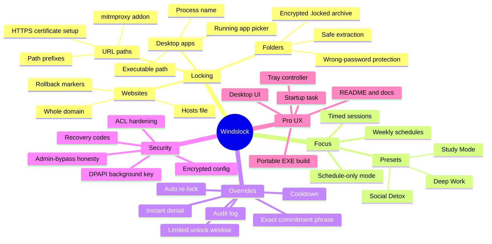
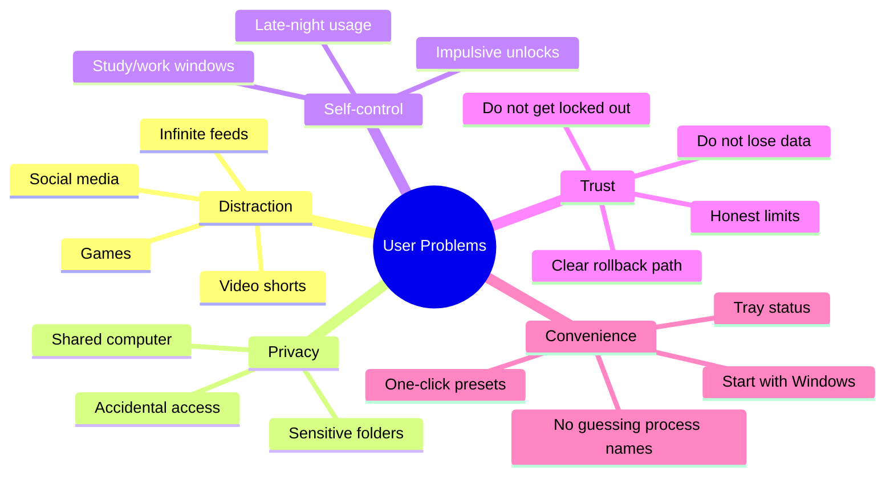
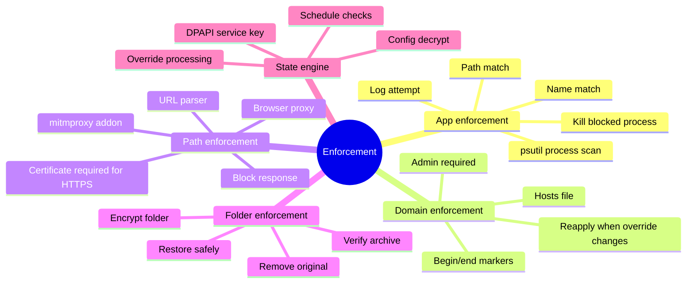
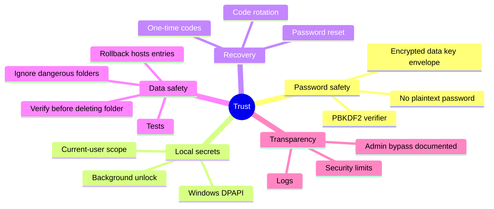
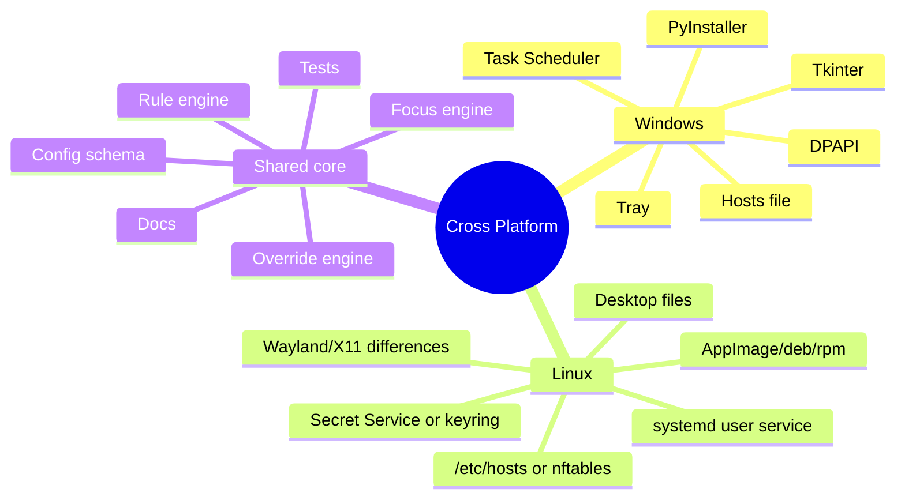

# Windslock Mind Maps

These maps show the product as a complete focus-security system.

## Product Mind Map

## User Problem Mind Map

## Enforcement Mind Map

## Trust And Recovery Mind Map

## Platform Expansion Mind Map

