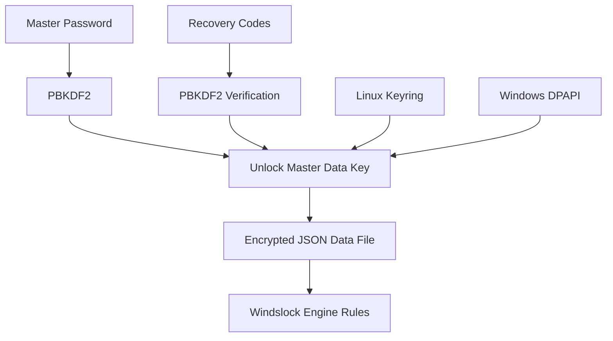

# Windslock Mind Maps & Architecture Diagrams

These Mermaid.js diagrams outline the high-level architecture, database flows, and security measures of the application.

## Pro UI Flow & Architecture
```mermaid
graph TD
    UI[Windslock UI (CustomTkinter)]
    UI --> DB[EncryptedDatabase]
    UI --> Control[Enforcement Control]
    UI --> Overrides[Override / Friction Manager]
    UI --> Proxy[Path-Level Proxy]

    Control --> Enforcer[Background Enforcer]
    Enforcer --> Process[Process Watcher]
    Enforcer --> DB
```

## Security & Database Architecture

