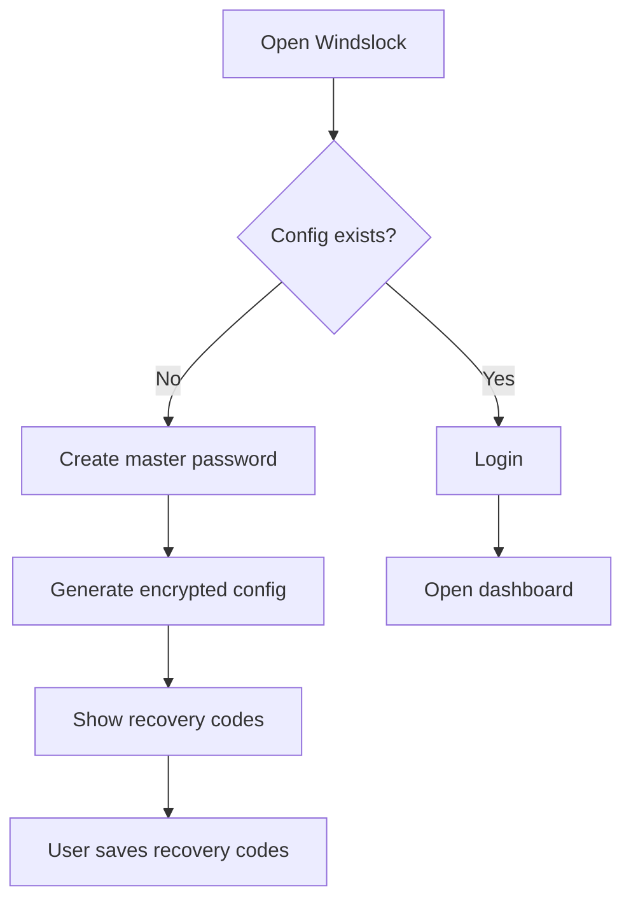
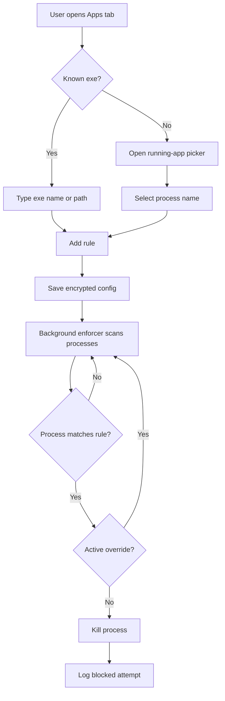
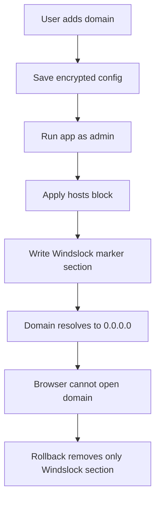
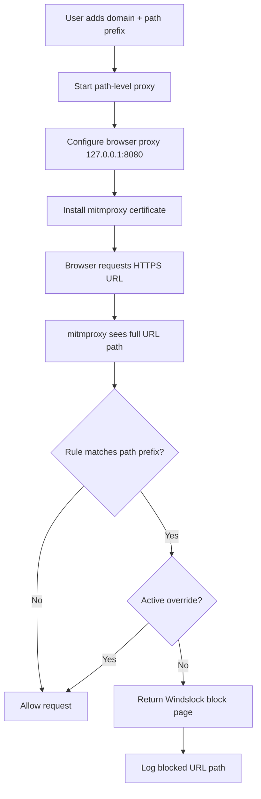
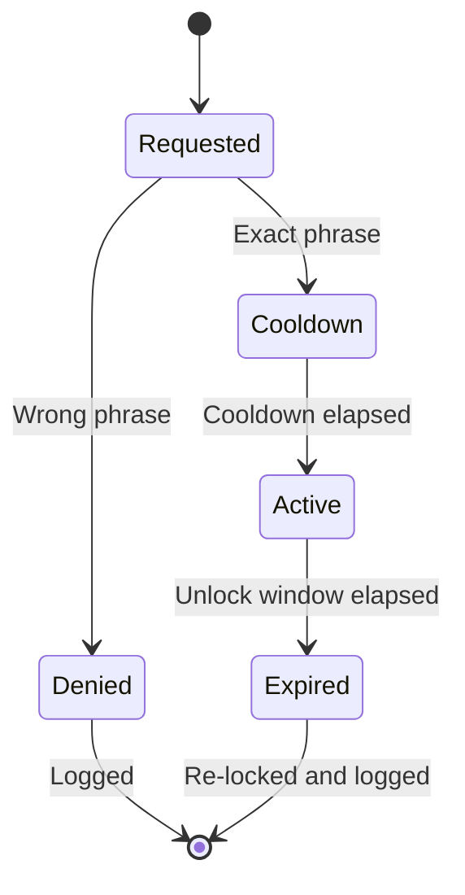
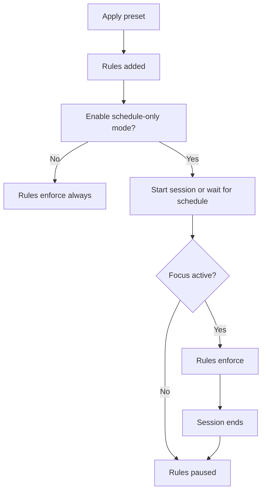
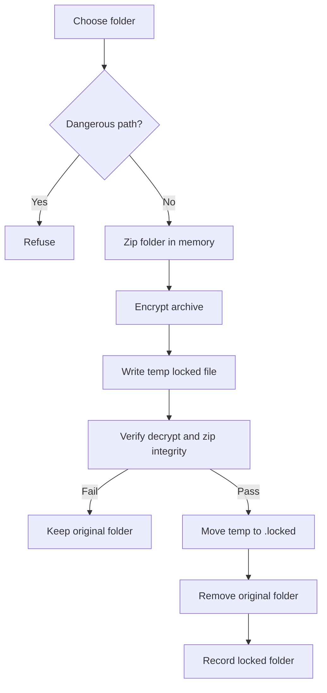
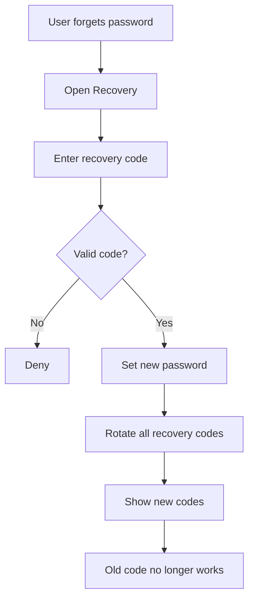
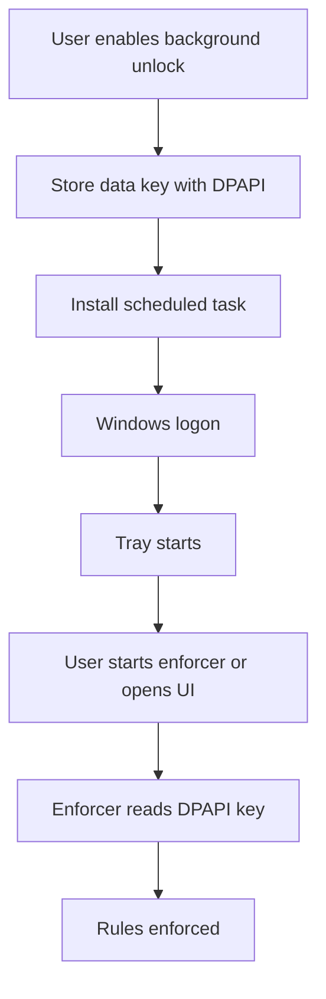

# Windslock Workflows

This document describes the key user and system workflows.

## First Run

Success criteria:

- No plaintext password is stored.
- Recovery codes are shown once.
- User reaches dashboard only after setup/login.

## App Lock Workflow

## Website Domain Block Workflow

Rollback guarantee:

- Windslock only removes content between `BEGIN WINDSLOCK BLOCKS` and `END WINDSLOCK BLOCKS`.

## Path-Level Website Block Workflow

Important limit:

- HTTPS path blocking requires the local certificate because HTTPS hides URL paths from DNS and hosts-file tools.

## Friction Override Workflow

Default timers:

- Cooldown: 5 minutes
- Unlock window: 10 minutes

Every state transition is written to the encrypted audit log.

## Focus Session Workflow

## Folder Lock Workflow

## Emergency Recovery Workflow

## Pro Startup Workflow

